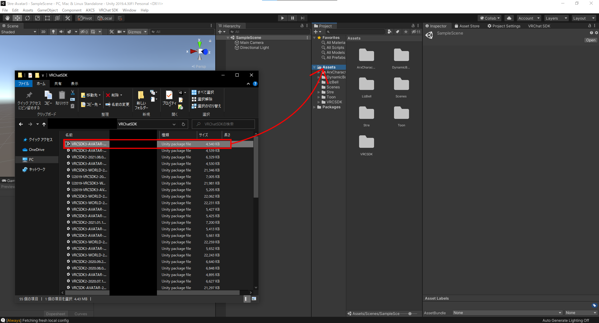
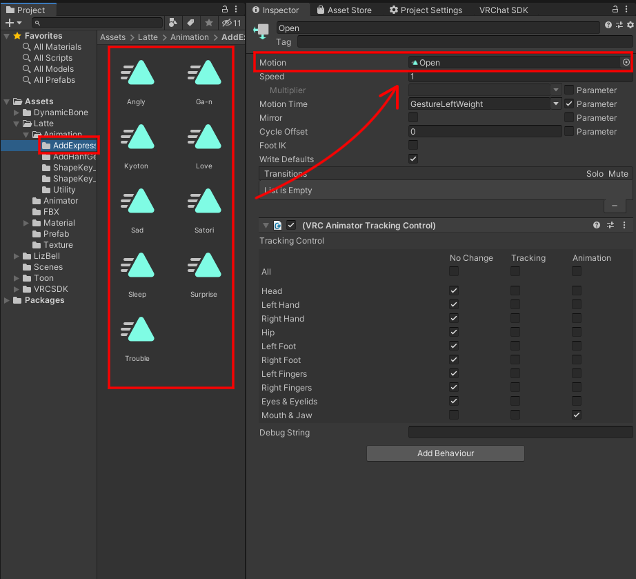

# Latte仕様詳細および導入マニュアル

2021/10/22　アライラク

 

## 利用規約

[https://github.com/AraiRacu/Licence](https://github.com/AraiRacu/Licence) を参照してください。

アライラク(以下「制作者」)の制作した素材(以下「本件素材」)を購入・利用する全てのお客様(以下「利用者」)は、上記URLに記載する利用規約(以下「本規約」)に同意したものといたします。

 

# はじめに

VRChat公式から、Avatar2.0の新規プロジェクト立ち上げが非推奨になりました。それに伴い、Latte-ver1.20より、Avatart2.0の対応を終了し、Avatar3.0へ一本化を行います。

本マニュアルの説明もAvatar3.0向けに対応を行いました。

 

# 目次

- [配布物内容](#配布物内容)
- [アップロードまでの流れ](#アップロードまでの流れ)
- [シェイプキー](#シェイプキー)
  - [Avatar3.0でのシェイプキーの入れ替え](#Avatar3.0でのシェイプキーの入れ替え)
  - [LisSyncの干渉防止について](#LisSyncの干渉防止について)
  - [Idelアニメーションについて](#Idelアニメーションについて)
  - [プリセット表情](#プリセット表情)
  - [漫符オブジェクト](#漫符オブジェクト)
    - [導入の方法](#導入の方法)
    - [漫符アニメーションの設定方法](#漫符アニメーションの設定方法)
    - [漫符オブジェクト一覧](#漫符オブジェクト一覧)
- [同梱プレハブ](#同梱プレハブ)
- [VRM](#VRM)
- [DynamicBone](#DynamicBone)
  - [DynamicBoneの設置場所](#DynamicBoneの設置場所)
  - [ねじり打ち消し機構スカート](#ねじり打ち消し機構スカート)
- [同梱3Dオブジェクト](#同梱3Dオブジェクト)
  - [Latte\.fbx](#Lattefbx)
    - [Humanoid化](#Humanoid化)
  - [Manpu\.fbx](#Manpufbx)
- [マテリアルおよびテクスチャ](#マテリアルおよびテクスチャ)
  - [マテリアル](#マテリアル)
  - [UTS2\.0](#UTS20)
  - [テクスチャ](#テクスチャ)
- [その他](#その他)

 

# 配布物内容

Latte_v1_20.zip/

　　┝Model/

　　│　┝Latte.fbx

　　│　┝Manpu.fbx

　　│　└Tex/

　　│　　　┝Latte_Tex_Simple.psd

　　│　　　┝Latte_Tex_Raw.psd

　　│　　　└Manpu.psd

　　┝VRM/

　　│　┝LatteVRM.vrm

　　│　└VRMSpring.json

　　┝Latte.unitypackage

　　┝readme_jp.txt

　　┝readme_en.txt

　　┝Licence_GitHub

　　└Latte_Manual

 

# アップロードまでの流れ

※Unity2019.4.31fでの方法です。

参考：【最新版】初心者向け：VRChatのアバターアップロード方法 - ASTONESS

　　　[https://astoness.com/blogs/times/how-to-upload-avatar-vrchat](https://astoness.com/blogs/times/how-to-upload-avatar-vrchat)

 

前提条件

- VRChatのアカウント取得
- Unityのアカウント取得
- Unity2019.4.31fのインストール
- 最新版のVRCSDK3-Avatarsの入手
- 本製品のダウンロードおよび解凍
- VRChatトラストシステムによるアバターアップロードの解禁

 

#### 1. Unityを起動し、新規プロジェクトを作成します

   ※Unityアカウントでのログインが必要な場合があります。

   ※Unity Hubを使用している場合、手順が異なります。

   1. Unityを起動し、プロジェクトを作成します。**Project name** に適当なプロジェクト名を入力し、**Template** を**3D** にします。入力後、**Create project** を押します。

      

       

      

   2. しばらくするとプロジェクトが作成され、Unityの画面が表示されます。

       

#### 2. Unityにパッケージをインポートします

1. **VRCSDK3-Avatars** をインポートします。エクスプローラーからUnityの**Project** タブの**Asset** フォルダにD&Dします。その後、Import画面が開くので、**Import** 押してしばらくするとインポートされます。

   

2. **DynamicBone** があれば、ここで、インポートします。**Asset Store** のタブの購入画面などから**Import** を押し、インポートします。

   

3. 本製品の**Latte.unitypackage** をインポートします。操作は1.のVRCSDKをインポートとしたときと同様です。ユニティちゃんトゥーンシェーダー2.0.8は本パッケージに同梱しているので追加でインポートする必要はありません。

#### 3.VRCSDKにログインします

1. 上のメニューバーの**VRChat SDK** ->**Show Control Panel** でVRChatのコントロールパネルを開き、**Authentication** でログインをします。

   

   

#### 4. Sceneを開きます

1. **Project** タブの**Asset/Latte** から**Latte.unity**をダブルクリックで開いてください。**Hierarchy** にセットアップ済みのアバターのプレハブが用意しています。プレハブの種類については[ここ](#同梱プレハブ) を参照してください。

   

#### 5.アバターをVRChatにアップロードします

1. シーンを保存します。ここで**Ctrl+Shift+ S** で適当なシーン名で保存します。

   ※ここで別途、新規シーンで保存することをおすすめします。(改めてunitypackageをインポートするとLatte.untiyが上書きされることがあります。)

2. ログインしたVRChatコントロールパネル内の**Builder** の右下の**Build & Publish** を押します。

   ※Scene内に複数のアバターがある場合は**Builder** でアップロードするアバターを選択してください。

   

3. しばらくすると**Game** 画面で入力画面が開くので、**Avatar Name** に適当な名前、**Sharing** の**Private** にチェック、**The above infomation~** (同意について)にチェックを入れ、**Upload** を押します。

   

4. 少し待って、画像のような表示が出ればアップロード完了です。

   

 

# シェイプキー

## Avatar3.0でのシェイプキーの入れ替え

Avatar3.0で表情を変更する手順を説明します。

 

この章では、左右の手に同じ表情を割り当てることを行います。

1.**Animatorウィンドウ**を表示します。

2.**Projectウィンドウ**の**Latte/Animator**の中からAnimatorファイル、**Latte_AvatarV3HandsLayer_FX**を選択し、**Animatorウィンドウ**にAnimatorの内容を表示します。

3.AnimatorウィンドウのLayersタブを選択し、その下の**Left Hand**を選択し、左手のハンドジェスチャーのレイヤーを表示してください。

4.**Left Hand**の中にあるFist～ThumbsupのStateの中で、変更したい手の表情を選択します。この状態でInspectorウィンドウに移動するとそのStateの内容が表示されています。

5.Projectウィンドウから**Stre/Animation/AddExpression**内の変更したいアニメーションをInspector内の**Motion**にアタッチします。

6.次に、右手の設定をします。同じAnimatorでLayersタブに並んている**Right Hand**を選択してください。

7.Left Handと同様に変更したい手の表情のStateを選択し、Inspector内のMotionに変更するAnimationにアタッチします。

 

## LisSyncの干渉防止について

Avatar3.0の機能で、ハンドジェスチャーで表情を変更しているときにリップシンクを行わない設定ができます。

 

**Projectウィンドウ**の**Latte/Animator**の中からAnimatorファイル、**Latte_AvatarV3HandsLayer_FX**でのRight Hand及びLeft Handの表情がアタッチされているStateに**VRC Animator Tracking Control**が刺してあり、その中の**Mouth&Jaw**の**Animation**のチェックをつけることで干渉を防止しています。

 

参照：[VRChat] Avatars3.0で表情切り替え時のまばたき干渉防止を実装する - がとーしょこらの技術録

[https://gatosyocora.hatenablog.com/entry/2020/08/09/094945](https://gatosyocora.hatenablog.com/entry/2020/08/09/094945)

 

## Idelアニメーションについて

本製品は立ち状態、座り状態時に図のような立ち姿、座り姿になるようにIdelアニメーションを付属しています。

立ち状態、座り状態はそれぞれ、**Latte/Animator**内の**Latte_AvatarV3LocomotionLayer**及び**Latte_Avatar3_Sitting**で用いています。

アニメーション自体は**Latte/Animation/Utility**内に入っています。

## プリセット表情

デフォルトでアバターに入っている表情は以下のとおりです。

 

追加でセットアップ済みのアニメーションは以下のとおりです。

 

手の表情も以下のような設定しています。

 

## 漫符オブジェクト

本製品には追加パーツとして漫符をまとめた3Dデータを同梱しています。

同梱プレハブにはすでに実装していますが、新規で導入する際の手順を設定します。

魂はシェイプキーではなくボーンの拡大縮小、移動によって制御しているため、注意が必要です。

### 導入の方法

1. Hierarchy上に**Latte/Prefab** 内の漫符プレハブ(**Manpu** )をD&Dで起きます。このとき、プレハブのTransformが初期化されていない場合、Reset Transformで初期化してください。(※このときはHierarchy直下に置いてください)

   

2. このプレハブに**Latte/Animation/Utility**内**GhostOn** のアニメーションを直接アタッチしてください。この状態で再生すると魂が表示されている状態になります。(Animatorが自動生成されます)

   

3. HierarchyタブでManpuを選択している状態で、Animationタブを開き、Previewをクリックします。すると、魂が表示されます。

   

4. 魂の出始めをアバターの口元に合わせるように、プレハブのTransformを調整します。

   

5. 調整後、プレハブにアタッチしているAnimatorのコンポーネントを削除します。(2で生成されたAnimatorも削除しても問題ありません)

   

6. プレハブをアバターのHeadの子にします。

   

7. 以上で、漫符の導入は完了します。

    

### 漫符アニメーションの設定方法

- **Latte/Animation/Utility**内にある**Manpu**に漫符シェイプキーのパスも同梱しているので、これをコピー＆ペーストで追加して設定してください。**Manpu**には魂を非表示するアニメーションが入っています。
- 魂の表示するアニメーションは同フォルダ内**GhostOn_InPath** に含まれているため、コピー＆ペーストするだけで実装できます。
- **Latte/Animation/Utility**内の**ShapeKeyAll** には漫符オブジェクトを含めたすべてのシェイプキーがあります。

 

### 漫符オブジェクト一覧

 

# 同梱プレハブ

本製品には以下のプレハブを用意しています。それ以外については改変をお願いします。

- **Latte** (デフォルト)

  - (DB)ねじり打ち消し機構インサイドコライダー搭載スカート
  - (マテリアル)通常版マテリアル

- **Latte_simple** (Simpleマテリアルの使用)

  - (DB)ねじり打ち消し機構インサイドコライダー搭載スカート
  - (マテリアル)簡易版マテリアル

- **Latte_DBOSC** (DynamicBoneのスカートのアウトサイドコライダーの使用)

  - (DB)通常のアウトサイドコライダー搭載スカート
  - (マテリアル)通常版マテリアル

  インサイドコライダースカートに比べ、処理が軽量。ただし、足がスカートを貫通する。

- **Manpu** 

  - 漫符オブジェクトのみのプレハブ
  - DB搭載
  - デフォルトで魂は収納状態

 

# VRM

本製品にはVRChat以外のVRSNS等で扱いやすいVRMも同梱しています。

規約の範囲内での利用が可能です。

ポリゴン数が32000以上であるため、clusterには制限によりアップロードができないです。

 

# DynamicBone

## DynamicBoneの設置場所

スカート以外のDynamicBoneは以下のボーンに設置しています。

- 鞄
  - Bag
- 胸
  - breast.L
  - breast.R
- 髪の毛
  - FrontHair
  - SideHair.L
  - SideHair.R
  - BackHair
  - BackSideHair.L
  - BackSideHair.R
- 漫符
  - Ghost1
  - ManpuDB

 

## ねじり打ち消し機構スカート

本製品では足のスカート貫通を抑えるため、ヒヨ様([@Hiyo_4tweetECO](https://twitter.com/Hiyo_4tweetECO))のインサイドコライダー式スカートおよびねじり打ち消し機構を用いています。

さらに、これを実装するためにほけ様([@hoke946](https://twitter.com/hoke946))のSkirtSupporterにより、実装しています。

 

当機構を実装しているプレハブのスカートはfbxファイルの親子構造と異なっています。

そのため、配布されているUnityのコンポーネントコピーツールなどを使用する場合、うまくコピーされないことがあるため、注意してください。

 

機構な原理やツールの詳細は以下のリンクを参照してください。

参考：【VRChat向け】ねじり打ち消し機構の解説書 - ヒヨ家の交易所 

　　　　[https://booth.pm/ja/items/1819470](https://booth.pm/ja/items/1819470 )

　　　SkirtSupporter説明書 - ほけ

　　　　[https://sites.google.com/view/skirtsup](https://sites.google.com/view/skirtsup)

 

# 同梱3Dオブジェクト

## Latte\.fbx

- ポリゴン数：38067

- オブジェクト構成

  Armature

  Body(頭)

  body(胴体)

  Body_Trans

  Hair

  Underwear

  Costume

### Humanoid化

ブレンダー等でfbxファイルを改変し、Unityで改めてHumanoid化を行う際に注意することがあります。

Humanoidの設定画面において、以下の画像のように**Reset** を押します。親指のボーンが赤くなり、Tポーズではないという警告が出ますが、そのまま**Done** を押してHumanoid化を行います。

前髪のボーンが自動で顎のボーンになってしまっている場所も消しておいてください

 

## Manpu\.fbx

- ポリゴン数：1156

- オブジェクト構成

  ManpuArmature
  
  Manpu

 

漫符オブジェクトの詳細は[ここ](#漫符オブジェクト) を参照してください。

 

# マテリアルおよびテクスチャ

## マテリアル

本製品には通常版マテリアルと簡易版マテリアルの2種を用意しています。通常版には1影がテクスチャとして設定していますが、簡易版にはメインカラー1枚のみを使用しています。

**通常版マテリアル** ：想定しているシェーディング、色改変には2枚のテクスチャを作成する必要あり

**簡易版マテリアル** ：メインテクスチャ1枚のみのマテリアル、色改変には1枚のテクスチャのみを用意する。色改変が容易

 

#### 通常版マテリアル

- **LatteMain** ：素体、頭、衣装、下着
- **LatteHair** ：髪の毛
- **LatteOpacity** ：透過オブジェクト

 

貫通を防ぐため、素体および衣装の一部をCutOffを用いて不可視化しています。

衣装を消すなどの改変を行う際には**LatteMain** 内の**ClippingMask** のテクスチャを消すことで表示されるようになります。

 

#### 簡易版マテリアル

- **LatteCos_Simple** ：衣装、下着
- **LatteSkin_Simple** ：素体、頭
- **LatteHair_Simple** ：髪の毛
- **LatteOpacity_Simple** ：透過オブジェクト

 

簡易版マテリアルも同様に、貫通を防ぐため、素体および衣装の一部をCutOffを用いて不可視化しています。

衣装を消すなどの改変を行う際には**LatteCos_Simple** および**LatteSkin_Simple** 内の**ClippingMask** のテクスチャを消すことで表示されるようになります。

 

#### 漫符オブジェクト用

- **Manpu** 

 

## UTS2\.0

ユニティ・テクノロジーズ・ジャパン合同会社のユニティちゃんトゥーンシェーダー 2.0 (UTS2.0) Ver.2.0.8 を使用しています。UTS2.0.8 は本UnityPackageに同梱しています。 

「ユニティちゃんトゥーンシェーダー 2.0」は、UCL2.0（ユニティちゃんライセンス 2.0）で提供されます。 ユニティちゃんライセンスについては、以下を参照してください。 

UCL2.0 [http://unity-chan.com/contents/guideline/](http://unity-chan.com/contents/guideline/)

 

## テクスチャ

本製品にはpsdファイルとして以下のテクスチャのデータを同梱しています。

- **Latte_Tex_Simple.psd** ：部位ごとにレイヤーをまとめているpsd、マスクなし、簡単な色改変向け
- **Latte_Tex_Raw.psd** ：1レイヤー1色レベルに分けられているpsd、マスク付き、詳細な改変用

- **Manpu.psd** ：漫符オブジェクト用のpsd

 

# その他

その他、疑問やバグなどがあれば以下の連絡先に連絡をお願いします。 

アライラク (Twitter : [@AraiRacu](https://twitter.com/AraiRacu)) 

 

# リリースノート

2020/04/10 初稿

2021/10/22 Avatar3.0用に改訂