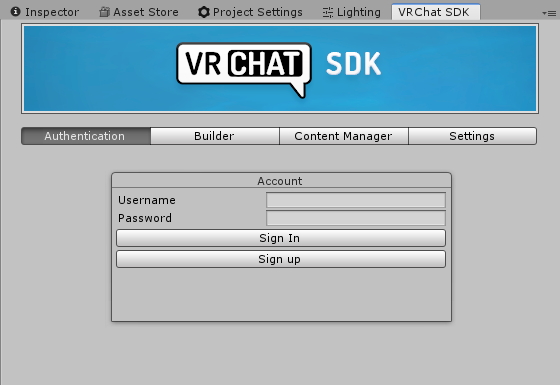
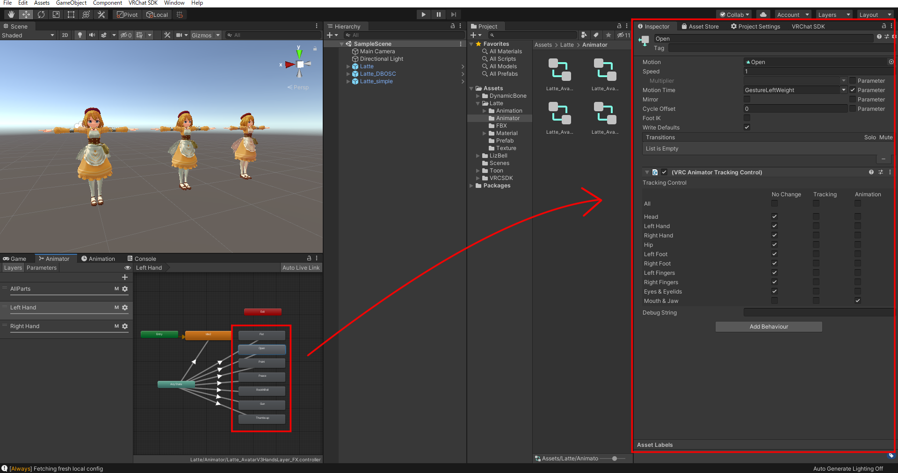
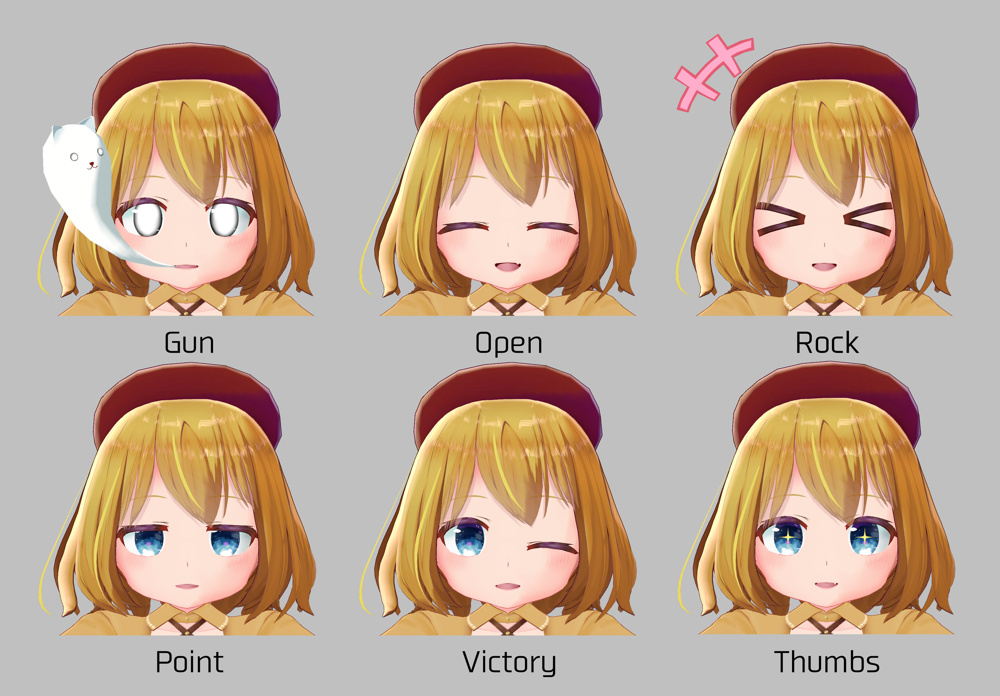

# Latte仕様詳細および導入マニュアル

2020/04/10　アライラク

 

## 利用規約

https://github.com/AraiRacu/Licenceを参照してください。

アライラク(以下「制作者」)の制作した素材(以下「本件素材」)を購入・利用する全てのお客様(以下「利用者」)は、上記URLに記載する利用規約(以下「本規約」)に同意したものといたします。

 

# 目次

(B)のマークが付いているものはUnityのアップロードが初めての方向けです。

 

- [配布物内容](#配布物内容)
- [アップロードまでの流れ(B)](#アップロードまでの流れ(B))
- [シェイプキー](#シェイプキー)
  - [アニメーションオーバーライドの設定(B)](#アニメーションオーバーライドの設定(B))
  - [シェイプキー干渉対策](#シェイプキー干渉対策)
  - [Idelアニメーションについて](#Idelアニメーションについて)
  - [プリセット表情](#プリセット表情)
  - [漫符オブジェクト](#漫符オブジェクト)
    - [導入の方法](#導入の方法)
    - [漫符アニメーションの設定方法](#漫符アニメーションの設定方法)
    - [漫符オブジェクト一覧](#漫符オブジェクト一覧)
- [同梱プレハブ](#同梱プレハブ)
- [VRM](#VRM)
- [DynamicBone](#DynamicBone)
  - [DynamicBoneの設置場所](#DynamicBoneの設置場所)
  - [ねじり打ち消し機構スカート](#ねじり打ち消し機構スカート)
- [同梱3Dオブジェクト](#同梱3Dオブジェクト)
  - [Latte.fbx](#Latte.fbx)
    - [Humanoid化](#Humanoid化)
  - [Manpu.fbx](#Manpu.fbx)
- [マテリアルおよびテクスチャ](#マテリアルおよびテクスチャ)
  - [マテリアル](#マテリアル)
  - [UTS2.0](#UTS2.0)
  - [テクスチャ](#テクスチャ)
- [その他](#その他)

 

# 配布物内容

Latte_v1_00.zip/

　　┝Model/

　　│　┝Latte.fbx

　　│　┝Manpu.fbx

　　│　└Tex/

　　│　　　┝Latte_Tex_Simple.psd

　　│　　　┝Latte_Tex_Raw.psd

　　│　　　└Manpu.psd

　　┝VRM/

　　│　┝LatteVRM.vrm

　　│　└VRMSpring.json

　　┝Latte.unitypackage

　　┝readme_jp.txt

　　┝readme_en.txt

　　┝Licence_GitHub

　　└Latte_Manual

 

# アップロードまでの流れ(B)

※Unity2018.4.20fでの方法です。

参考：VRChat 購入したアバターのアップロード方法 - テトラログ

​			[https://tetoralog.com/vrc/vrc-avatar-upload.html](https://tetoralog.com/vrc/vrc-avatar-upload.html)

 

前提条件

- VRChatのアカウント取得

- Unityのアカウント取得

- Unity2018.4.20fのインストール

- 最新版のVRCSDK2の入手・本製品のダウンロードおよび解凍

  ※アバターアップロードの際、VRCSDK3は使用しないでください。

- VRChatトラストシステムによるアバターアップロードの解禁

 

#### 1. Unityを起動し、新規プロジェクトを作成します

   ※Unityアカウントでのログインが必要な場合があります。

   1. Unityを起動し、プロジェクトを作成します。**Project name** に適当なプロジェクト名を入力し、**Template** を**3D** にします。入力後、**Create project** を押します。

      

       

      

   2. しばらくするとプロジェクトが作成され、Unityの画面が表示されます。

       

#### 2. Unityにパッケージをインポートします

1. **VRCSDK2** をインポートします。エクスプローラーからUnityの**Project** タブの**Asset** フォルダにD&Dします。その後、Import画面が開くので、**Import** 押してしばらくするとインポートされます。

   

2. **DynamicBone** があれば、ここで、インポートします。**Asset Store** のタブの購入画面などから**Import** を押し、インポートします。

   

3. 本製品の**Latte.unitypackage** をインポートします。操作は1.のVRCSDKをインポートとしたときと同様です。ユニティちゃんトゥーンシェーダー2.0.7.5は本パッケージに同梱しているので追加でインポートする必要はありません。

#### 3.VRCSDKにログインします

1. 上のメニューバーの**VRChat SDK** ->**Show Control Panel** でVRChatのコントロールパネルを開き、**Authentication** でログインをします。

   

   

#### 4. Sceneにアバターを配置します

1. **Project** タブの**Latte/Prefab** からアップロードするプレハブを**Hierarchy** にD&Dします。プレハブの種類については[ここ](#同梱プレハブ)を参照してください。

   

#### 5.アバターをVRChatにアップロードします

1. シーンを保存します。ここで**Ctrl + S** で適当なシーン名で保存します。デフォルトでは**Asset/Scene** に**SampleScene** として置かれます。

2. ログインしたVRChatコントロールパネル内の**Builder** の右下の**Build & Publish** を押します。

   ※Scene内に複数のアバターがある場合は**Builder** でアップロードするアバターを選択してください。

   

3. しばらくすると**Game** 画面で入力画面が開くので、**Avatar Name** に適当な名前、**Sharing** の**Private** にチェック、**The above infomation~** (同意について)にチェックを入れ、**Upload** を押します。

   

4. 少し待って、画像のような表示が出ればアップロード完了です。

   

 

# シェイプキー

## アニメーションオーバーライドの設定(B)

デフォルトの表情から付属している追加の表情へ変更する場合、以下の手順で可能です。

 

1. 変更するシェイプキーのバックアップをCtrl+Dで取ります。プレハブで使用しているシェイプキーは**Latte/Animation/Interference/ShapeKey** に入っています。バックアップしたアニメーションファイルの名前を**\~\_Backup** など適当な名前に変えておくとわかりやすいです。

   

2. 変えたい表情のアニメーションファイルを**Latte/Animation/Interference/Add**  内から選択します。(指の表情は**Latte/Animation/Common** にあります)

3. 2.でアニメーションファイルを選択した状態で、Animationタブを開き、つけたい表情のキーフレームを表示します。キーフレームをCtrl+Aですべて選択し、Ctrl+Cでコピーします。

   

4. 1.で選択した変更するシェイプキーを選択し、AnimationタブでCtrl+Vでペーストします。

   

5. 表情を変更したいアバターのアニメーションオーバーライドを表示します。(アバターについているAvatar Descriptor内、**Custom Standing/Sitting Anims** にアタッチされているものです。)

   

6. 作成したアニメーションを該当の場所にアタッチします。

   

7. この状態でアップロードすると実装されます。

 

## シェイプキー干渉対策

アニメーションオーバーライドの表情とリップシンクが干渉し、表情が破綻することを防ぐために、表情を表示中はリップシンクを行わない仕組みをureishi様([@aivrc](https://twitter.com/aivrc))の方式を導入しました。

 

このため、頭部のメッシュの親子構造がfbxファイルの状態から変更しています。これに伴い、表情アニメーションのパスも一般的なものと異なり、**LipSync/Body** となっています。

 

以上から、表情アニメーションは2種類のものを用意しています。

**Latte/Animation/Normal** ：シェイプキー干渉対策をしていない一般的な3Dモデルの直下に頭部メッシュがある場合のアニメーション群。シェイプキー干渉対策をしない場合に利用してください。

**Latte/Animation/Interference** ：シェイプキー干渉対策用に作成されたアニメーション群。プレハブ等にはここのアニメーションを使用しています。

 

### シェイプキー干渉対策の実装方法

1. 3Dオブジェクトの親子関係を以下の画像のようにします。3Dモデルの直下に空のゲームオブジェクトを作成し、リネームをします(画像ではLipSync)。作成したからのゲームオブジェクト、LipSyncをBody(頭部メッシュ)の親にします。BodyはCtrl+Dで複製し、非アクティブにして3Dモデルの直下に置きます。

   

2. LipSyncに**Animatior** コンポーネントを追加します。このコンポーネントは非アクティブにしておきます。**Latte/Animation/Interference/Animator** 内のアニメーションコントローラの**LipSync** をAnimatorにアタッチします。

   

    

### 干渉対策用の表情アニメーションの作成

3. Bodyのシェイプキーのパスが**LipSync/Body** となった以外は通常通りに設定します。

2. 表情を設定し終わったアニメーションに**Latte/Animation/Interference** 内の**LipSyncAnimator** 内の2フレーム分のアニメーションをコピー＆ペーストします。

   

   

3. このアニメーションファイルを通常通りアニメーションオーバーライドにアタッチします。

 

参考：表情・リップシンク・まばたきの干渉対策 [VRChat] - Package Shop @aivrc

​				[https://booth.pm/ja/items/1532584](https://booth.pm/ja/items/1532584)

 

## Idelアニメーションについて

本製品は立ち状態、座り状態時に設定した立ち姿、座り姿になるようにIdelアニメーションを付属しています。

立ち状態、座り状態にそれぞれ、アニメーションオーバーライドが必要なことから、2種のアニメーションオーバーライドが**Latte/Animation/Interference/Animator** にあります。それぞれ**Idel** にアタッチされているアニメーションが異なっている以外は同じです。(Latte/Animation/Normal/Animatorについても同様です。)

## プリセット表情

デフォルトでアバターに入っている表情は以下のとおりです。

 

追加でセットアップ済みのアニメーションは以下のとおりです。

 

手の表情も以下のような設定しています。

 

## 漫符オブジェクト

本製品には追加パーツとして漫符をまとめた3Dデータを同梱しています。

同梱プレハブにはすでに実装していますが、別のモデルデータであるため、新規で導入する際などに導入する際の手順を設定します。

魂についてはシェイプキーではなくボーンの拡大縮小、移動によって制御しているため、注意が必要です。

### 導入の方法

1. Hierarchy上に**Latte/Prefab** 内の漫符プレハブ(**Manpu** )をD&Dで起きます。このとき、プレハブのTransformが初期化されていない場合、Reset Transformで初期化してください。(※このときはHierarchy直下に置いてください)

   

2. このプレハブに**Latte/Animation/Common** 内**GhostOn** のアニメーションを直接アタッチしてください。この状態で再生すると魂が表示されている状態になります。(Animatorが自動生成されます)

   

3. 魂の出始めをアバターの口元に合わせるように、プレハブのTransformを調整します。

   

4. 調整後、プレハブにアタッチしているAnimatorを削除します。(2で生成されたAnimatorは削除しても問題ありません)

   

5. プレハブをアバターのHeadの子にします。

   

6. 以上で、漫符の導入は完了します。

    

### 漫符アニメーションの設定方法

- **Latte/Animation/Common** 内にある**Manpu** に漫符シェイプキーのパスも同梱しているので、これをコピー＆ペーストで追加して設定してください。**Manpu** には魂を非表示するアニメーションが入っています。
- 魂の表示するアニメーションは同フォルダ内**GhostOn_InPath** に含まれているため、コピー＆ペーストするだけで実装できます。
- **Latte/Animation/Interference** or **Normal/Utility**  内の**ShapeKeyAll** には漫符オブジェクトを含めたすべてのシェイプキーがあります。

 

### 漫符オブジェクト一覧

 

# 同梱プレハブ

本製品には以下のプレハブを用意しています。それ以外については改変をお願いします。

- **Latte** (デフォルト)

  - (DB)ねじり打ち消し機構インサイドコライダー搭載スカート
  - (マテリアル)通常版マテリアル

- **Latte_simple** (Simpleマテリアルの使用)

  - (DB)ねじり打ち消し機構インサイドコライダー搭載スカート
  - (マテリアル)簡易版マテリアル

- **Latte_DBOSC** (DynamicBoneのスカートのアウトサイドコライダーの使用)

  - (DB)通常のアウトサイドコライダー搭載スカート
  - (マテリアル)通常版マテリアル

  インサイドコライダースカートに比べ、処理が軽量。ただし、足がスカートを貫通する。

- **Manpu** 

  - 漫符オブジェクトのみのプレハブ
  - DB搭載
  - デフォルトで魂は収納状態

 

# VRM

本製品にはVRChat以外のVRSNS等で扱いやすいVRMも同梱しています。

規約の範囲内での利用が可能です。

ポリゴン数が32000以上であるため、clusterには制限によりアップロードができないです。

 

# DynamicBone

## DynamicBoneの設置場所

スカート以外のDynamicBoneは以下のボーンに設置しています。

- 鞄
  - Bag
- 胸
  - breast.L
  - breast.R
- 髪の毛
  - FrontHair
  - SideHair.L
  - SideHair.R
  - BackHair
  - BackSideHair.L
  - BackSideHair.R
- 漫符
  - Ghost1
  - ManpuDB

 

## ねじり打ち消し機構スカート

本製品では足のスカート貫通を抑えるため、ヒヨ様([@Hiyo_4tweetECO](https://twitter.com/Hiyo_4tweetECO))のインサイドコライダー式スカートおよびねじり打ち消し機構を用いています。

さらに、これを実装するためにほけ様([@hoke946](https://twitter.com/hoke946))のSkirtSupporterにより、実装しています。

 

当機構を実装しているプレハブのスカートはfbxファイルの親子構造と異なっています。

そのため、配布されているUnityのコンポーネントコピーツールなどを使用する場合、うまくコピーされないことがあるため、注意してください。

 

機構な原理やツールの詳細は以下のリンクを参照してください。

参考：【VRChat向け】ねじり打ち消し機構の解説書 - ヒヨ家の交易所 

　　　　[https://booth.pm/ja/items/1819470](https://booth.pm/ja/items/1819470 )

　　　SkirtSupporter説明書 - ほけ

　　　　[https://sites.google.com/view/skirtsup](https://sites.google.com/view/skirtsup)

 

# 同梱3Dオブジェクト

## Latte.fbx

- ポリゴン数：38067

- オブジェクト構成

  Armature

  Body(頭)

  body(胴体)

  Body_Trans

  Hair

  Underwear

  Costume

### Humanoid化

ブレンダー等でfbxファイルを改変し、Unityで改めてHumanoid化を行う際に注意することがあります。

Humanoidの設定画面において、以下の画像のように**Reset** を押します。親指のボーンが赤くなり、Tポーズではないという警告が出ますが、そのまま**Done** を押してHumanoid化を行います。

前髪のボーンが自動で顎のボーンになってしまっている場所も消しておいてください

 

## Manpu.fbx

- ポリゴン数：1156

- オブジェクト構成

  ManpuArmature
  
  Manpu

 

漫符オブジェクトの詳細は[ここ](##漫符オブジェクト)を参照してください。

 

# マテリアルおよびテクスチャ

## マテリアル

本製品には通常版マテリアルと簡易版マテリアルの2種を用意しています。通常版には1影がテクスチャとして設定していますが、簡易版にはメインカラー1枚のみを使用しています。

**通常版マテリアル** ：想定しているシェーディング、色改変には2枚のテクスチャを作成する必要あり

**簡易版マテリアル** ：メインテクスチャ1枚のみのマテリアル、色改変には1枚のテクスチャのみを用意する。色改変が容易

 

#### 通常版マテリアル

- **LatteMain** ：素体、頭、衣装、下着
- **LatteHair** ：髪の毛
- **LatteOpacity** ：透過オブジェクト

 

貫通を防ぐため、素体および衣装の一部をCutOffを用いて不可視化しています。

衣装を消すなどの改変を行う際には**LatteMain** 内の**ClippingMask** のテクスチャを消すことで表示されるようになります。

 

#### 簡易版マテリアル

- **LatteCos_Simple** ：衣装、下着
- **LatteSkin_Simple** ：素体、頭
- **LatteHair_Simple** ：髪の毛
- **LatteOpacity_Simple** ：透過オブジェクト

 

簡易版マテリアルも同様に、貫通を防ぐため、素体および衣装の一部をCutOffを用いて不可視化しています。

衣装を消すなどの改変を行う際には**LatteCos_Simple** および**LatteSkin_Simple** 内の**ClippingMask** のテクスチャを消すことで表示されるようになります。

 

#### 漫符オブジェクト用

- **Manpu** 

 

## UTS2.0

ユニティ・テクノロジーズ・ジャパン合同会社のユニティちゃんトゥーンシェーダー 2.0 (UTS2.0) Ver.2.0.7.5 を使用しています。UTS2.0.7.5 は本UnityPackageに同梱しています。 

「ユニティちゃんトゥーンシェーダー 2.0」は、UCL2.0（ユニティちゃんライセンス 2.0）で提供されます。 ユニティちゃんライセンスについては、以下を参照してください。 

UCL2.0 [http://unity-chan.com/contents/guideline/](http://unity-chan.com/contents/guideline/)

 

## テクスチャ

本製品にはpsdファイルとして以下のテクスチャのデータを同梱しています。

- **Latte_Tex_Simple.psd** ：部位ごとにレイヤーをまとめているpsd、マスクなし、簡単な色改変向け
- **Latte_Tex_Raw.psd** ：1レイヤー1色レベルに分けられているpsd、マスク付き、詳細な改変用

- **Manpu.psd** ：漫符オブジェクト用のpsd

 

# その他

その他、疑問やバグなどがあれば以下の連絡先に連絡をお願いします。 

アライラク (Twitter : @AraiRacu) 

 

# リリースノート

2020/04/10 初稿